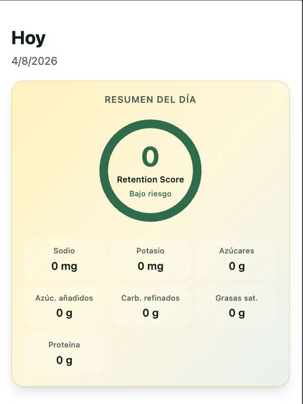
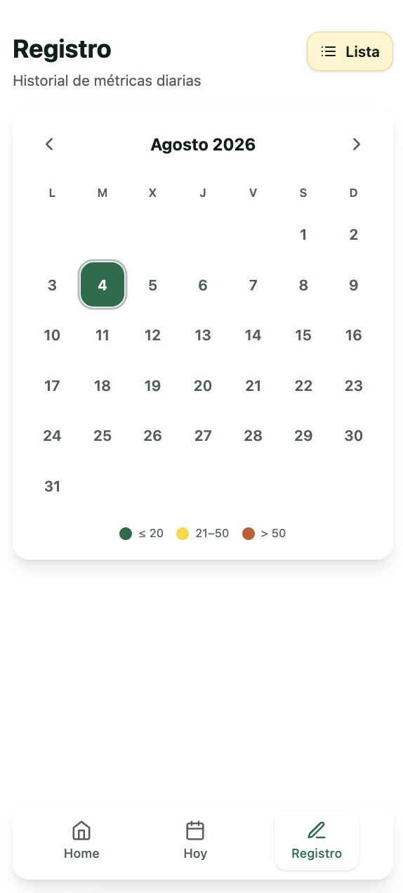
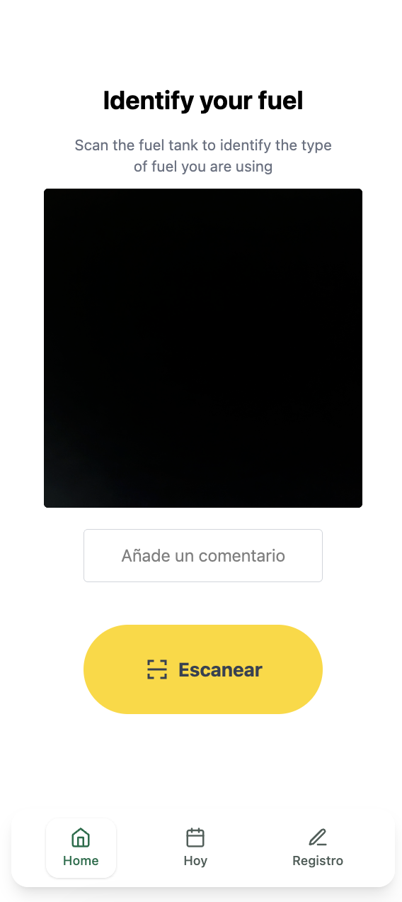

# ready4summer

A PWA that helps you track facial water retention by scanning your meals with your phone camera.

<div style="display: flex; width: 100%; height: auto; justify-content: space-between;">
   
   
   
</div>

## What it does

Point your camera at food, add an optional comment, and GPT-4o Vision analyzes the nutritional profile — focusing on the factors that cause facial bloating: sodium, refined carbs, sugar, potassium, and hydration.

Each meal gets a **Retention Score** (0–100) predicting how likely it is to puff up your face the next morning. Daily totals aggregate into a weighted average so you can track patterns over time.

## Features

- 📸 Camera scan with real-time preview
- 🤖 GPT-4o Vision nutritional analysis
- 💧 Facial retention score per meal and per day
- 📊 Daily summary with macro breakdown
- 📅 Calendar heatmap + list view history
- 📱 Installable PWA — works offline, feels native
- 💾 All data stored locally (localStorage)

## Stack

- React + TypeScript
- Tailwind CSS
- Vite + vite-plugin-pwa
- OpenAI API (GPT-4o-mini with vision)
- Vercel

## Run locally

```bash
pnpm install
pnpm dev
```

Add your API key in `.env.local`:

```
VITE_CHATGPT_API_KEY=sk-your-key
```
